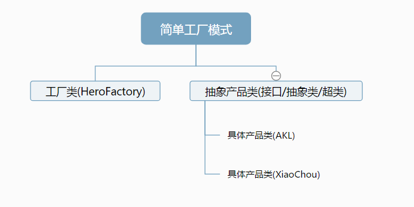
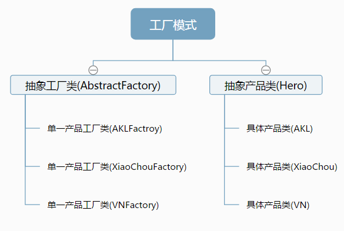
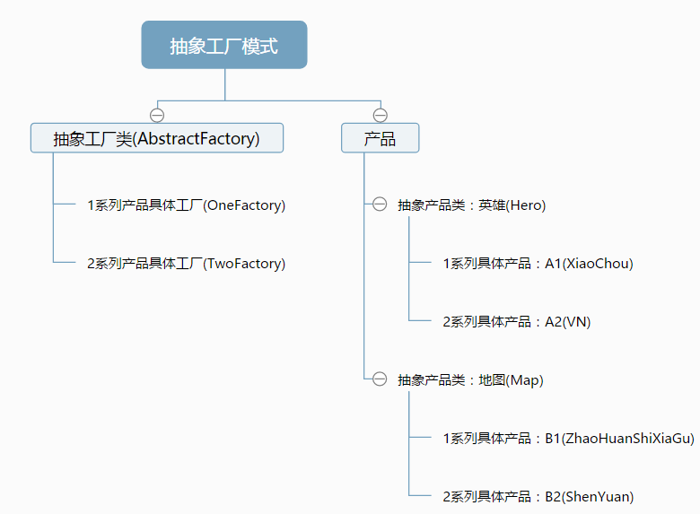
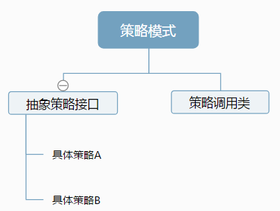
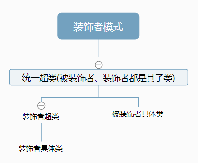
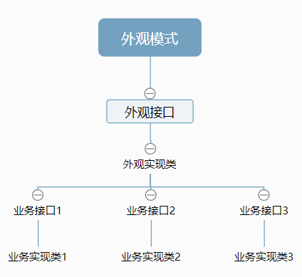
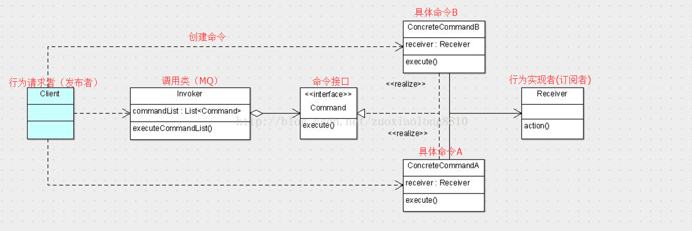
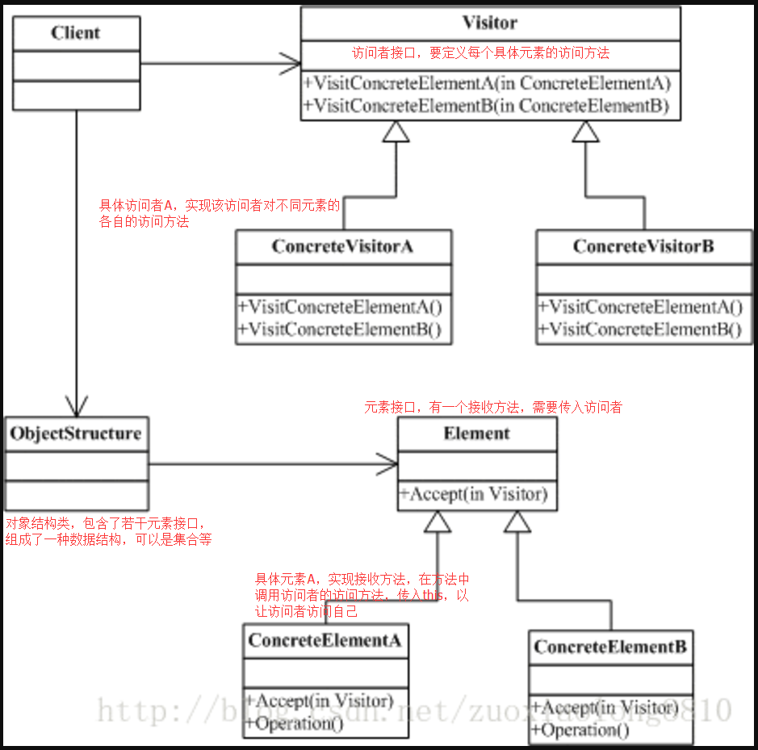

###设计模式斩魂之路
之前对设计模式的学习，写的东西感觉不太好，重新写下；

####设计模式六大规则
* 单一职责：每个类只负责单一的功能；
~~~
    十分重要的规则，可以将各个功能模块解耦，方便复用，扩展等；
~~~

* 里氏替换原则：子类可以替换父类，并且可以正常工作;
~~~
    该规则表明，子类一般不应该重写父类的方法，而是扩展父类的功能；
~~~

* 接口隔离原则:接口拥有的行为应该尽可能的小;
~~~
    否则，可能会出现，一个接口实现类，有一些方法是空的，并没有实现;
~~~

* 依赖倒置原则：高层模块不应该依赖低层模块，二者都应该依赖与抽象，抽象不应依赖细节（实现），细节（实现）应该依赖抽象;
~~~
    依赖抽象可以实现解耦，其抽象的实现并不会影响各个模块间的调用；
~~~

* 最小知道原则：一个类不需要知道其他类的细节;
~~~
    可以解耦，且每个类自身高内聚；
    高内聚指将一个类的细节全部写在该类内部，不透露给其他类
~~~

* 开闭原则：对修改关，对扩展开；
~~~
    尽量不修改原有代码；但要方便扩展功能
~~~

#### 注解-Annotation :额外增加的，下面有些模式要用到
* 元注解：用来注解 注解 的注解；
    1. @Target：表示注解的目标是类、方法还是哪里
        * ElementType.xx或{ElementType.xx,ElementType.xxx}
        * CONSTRUCTOR：构造器；FIELD：属性；LOCAL_VARIABLE:局部变量；METHOD：方法；
        * PACKAGE:包；PARAMETER:参数；TYPE:类、接口、枚举等
        * TYPE_PARAMETER:类型注解,<T>、<? extends A>等；TYPE_USE：可以任何用到类型的位置使用，例如用new关键字创建对象、类型转换、使用implements实现接口、throws等
    2. @Retention:表示该注解类的作用域/生命周期/保留周期，默认为CLASS
        * RetentionPolicy.xx
        * SOURCE:源文件；CLASS：class/字节码文件；RUNTIME:运行时
        * 一般只写RUNTIME，只有该注解才能动态获取参数
    3. @Documented：表示该注解会被javadoc文档化
    4. @Inherited：表示该注解是否有继承性，也就是父类被注解，子类继承父类后，是否也相当于被注解
    5. @Repeatable：表示是否可以重复使用该注解在同一语句
* 注解中于允许的参数：
        * 所有基本类型(byte,int,short,long,float,double,char,boolean)
        * String
        * Class
        * enum
        * Annotation
        * 以上所有类型的数组类型
* 当注解中的属性的名字为value时，注解时直接写xxx(a),a就会被赋值给属性名为value的属性
* Class<T>： 如果使用了@Repeatable注解，使A注解可以重复注解一个类(此时应该配置As类),且在B类上使用了多个A注解，但此时想要获取A注解获取不到的，只能获取到As注解（该注解包含A[]属性）
    getAnnotations()/Annotation[]:获取该类所有的注解；
    getAnnotation(Class<A>)/A:获取该类指定类型的注解；
    getDeclaredField()：该方法才能获取到private字段，Declared意思应该不是公开的，而是所有存在的的意思
#### 1.单例模式-Singleton
使用单例模式的类的显著特点：
    一个类没有自己的状态，就是一个类创建一个和创建多个是一样的。
单例与静态类的区别：
    1.可以多态（继承类、实现接口、被继承后方法可重写等）(B类如果继承A类，B.a()可以调用A类的静态方法a，但是该调用等价A.a()，假使在a()中输出一个属性的值，输出的会是A类的该属性值);
    2.可以在特定时间加载（这是错的，静态类也可以延迟加载，是在静态方法第一次被调用的时候加载的）;
1. 懒汉模式-lazy(实例会在第一次使用的时候加载)
~~~
    public class LazyClass {
        //私有化构造方法
        private LazyClass(){}
        //声明静态对象，不创建对应实例
        private static LazyClass lazyClass;
        //获取单例实例的方法
        public static LazyClass getInstance(){
            if(lazyClass == null)
                lazyClass = new LazyClass();
            return lazyClass;
        }
    }
~~~
2. 饱汉模式-hungry(实例直接创建)
~~~
    public class HungryClass {
        //私有化构造方法
        private HungryClass(){}
        //直接创建对应的实例
        private static HungryClass hungryClass = new HungryClass();
        //获取实例的方法
        public static HungryClass getInstance() {
            return hungryClass;
        }
    }
~~~
3. 双重检查锁模式-doubleCheckedLocking(改造饿汉模式，使其线程安全)（此处没有使用synchronized,而是使用了重入锁，该锁比较灵活，详见多线程项目）
~~~
    public class DoubleCheckedLocking {
        //私有化构造方法
        private DoubleCheckedLocking(){}
        //声明静态实例
        private static DoubleCheckedLocking doubleCheckedLocking;
        //重入锁
        private static ReentrantLock lock = new ReentrantLock();
        //获取实例
        public static DoubleCheckedLocking getInstance(){
            if(doubleCheckedLocking != null){
                lock.lock();
                if(doubleCheckedLocking != null){
                    doubleCheckedLocking = new DoubleCheckedLocking();
                }
                lock.unlock();
            }
            return doubleCheckedLocking;
        }
    }
    
    暂不确定是否要给静态实例添加volatile关键字，私以为，如果该类占用的过小，是有可能被分配到JVM的TLAB（也就是线程私有的缓冲区，详见JVM项目）的，也就有可能发生不可见性；
    ！！！看到一个关键的地方，volatile关键字可以禁止指令重排序；synchronized也可以禁止指令重排序
    
    此外可能产生bug:
        因为虚拟机在执行创建实例的这一步操作的时候，其实是分了好几步去进行的，也就是说创建一个新的对象并非是原子性操作。在有些JVM中上述做法是没有问题的，但是有些情况下是会造成莫名的错误。
        首先要明白在JVM创建新的对象时，主要要经过三步。
            1.分配内存
            2.初始化构造器
            3.将对象指向分配的内存的地址
        这种顺序在上述双重加锁的方式是没有问题的，因为这种情况下JVM是完成了整个对象的构造才将内存的地址交给了对象。
    但是如果2和3步骤是相反的（【指令重排序，happen—before原则（多线程项目中有相关解释）】），就会出现问题了。
        因为这时将会先将内存地址赋给对象，针对上述的双重加锁，就是说先将分配好的内存地址指给synchronizedSingleton，然后再进行初始化构造器，这时候后面的线程去请求getInstance方法时，
    会认为synchronizedSingleton对象已经实例化了，直接返回一个引用。如果在初始化构造器之前，这个线程使用了synchronizedSingleton，就会产生莫名的错误。
    
        上述这个bug是http://blog.csdn.net/zuoxiaolong8810/article/details/9005611这个博客中提出的；但我认为可能不太会，因为，加了锁的代码块应该是原子性的，那么即使指令重排序，
    在进行完原子操作后，也不会发生上述情况；即使不是这样，加上volatile关键词后，防止指令重排序后，应该也不会产生bug。(synchronized可以禁止指令重排序)
    (...原来博客主已经在文章末尾说了可以加volatile，不过他没有写synchronized可以禁止指令重排序)
~~~
4. 静态内部类模式-staticClass(据说最佳；使用时时初始化静态内部类，初始化静态内部类时加载对象，同时线程安全；如果构造方法抛出异常，则永远获取不到该实例)
~~~
    public class StaticClassClass {
        //私有化构造方法
        private StaticClassClass(){}
        //静态内部类
        private static class StaticClassClassInternal{
            private static StaticClassClass instance = new StaticClassClass();
        }
        //获取实例
        public static StaticClassClass getInstance(){
            return StaticClassClassInternal.instance;
        }
    }
~~~
5. 枚举模式-同上的优点，但是不能延迟加载；从效率上来说，该模式最快
~~~
public class A {
    //私有化构造方法
    private A(){}
    //内部静态枚举
    private static enum Singleton{
        INSTANCE;
        private A instance;
        Singleton(){
            instance = new A();
        }
        private A getInstance(){
            return instance;
        }
    }
    //获取实例方法
    public A getInstance(){
        return Singleton.INSTANCE.getInstance();
    }
}
~~~

#### 2.代理模式-proxy：在原有类的行为上增加一些行为
代理模式需要的类：
    * 被代理接口，定义了一些方法;
    * 被代理接口实现类，即被代理类，实现了接口的方法
静态代理需要的类:
    * 静态代理类：有代理接口属性，通过该属性调用原方法，并在此基础上扩展(类似装饰者类)；
动态代理需要的类：
    * 实现jdk的InvocationHandler接口的代理类，通过该代理类返回实现被代理接口(Hero)的普通实现类(HeroImpl)的代理实现类(也是Hero,但是是运行时动态生成的会经过invoke()方法的代理实现类)

1. 静态代理:static效率高，耗空间
   1. 代理类一般要持有一个被代理的对象的引用。
   2. 对于我们不关心的方法，全部委托给被代理的对象处理。
   3. 自己处理我们关心的方法。
2. 动态代理：dynamic
    JDK实现的动态代理实际上就是那个接口的一个空壳，所有调用的类实际上还是通过method.invoke(hero, args)方法中的第一个参数实现的，这个参数传的就是该接口的实现类实例。（具体可参考策略模式中的代码理解）
    与静态代理的区别在于，编译时代理类并没有生成。在运行是，代理类动态生成。编译时只有被代理类和一个委托类（用来生成代理类）。
    而且动态代理如果需要对代理类的所有方法进行相同操作的代理，也无需把所有方法重写一遍。
    从重构的角度来说，其实更简单点，那就是在你发现你使用静态代理的时候，需要写一大堆重复代码的时候，就请改用动态代理试试吧
    动态代理的被代理类必须实现一个接口，或者本身就是一个接口；
    
    在proxy/com.zx.dynamic.sourcecode包中，我写了对动态代理源码的简析；
    此外，在测试中，将动态生成的代理类字节码文件保存到本地；
    该代理类除了实现自身接口，还继承了Proxy类；然后有所有被代理类的方法(Method类型)的静态属性；
    每次执行任何方法时，都会先调用Proxy类中的h(动态代理类(实现InvocationHandler接口的类))的invoke方法，并将必要的实参传入

#### 3.工厂模式-factory:
创建不同的类-如果需要修改产品类的构造方法，只需要修改工厂类中的一处就可以了；
此外，假设产品是某个功能需要的东西，如果通过工厂模式创建，隐藏内部细节，那么日后想要更换具体产品也很容易，只需自己在内部更换就可以了，否则如果是普通的new的方式，已经多出耦合了
* 简单工厂模式-一个工厂类创造所有的产品
    * 扩展时需要修改工厂类代码
    

---
* 工厂模式-每个产品都有单独的用来创建它的工厂类，这些工厂类都继承自一个工厂超类
    * 扩展时只需增加一个工厂子类和一个产品子类，无需修改原代码
    

---
* 抽象工厂模式-和工厂模式类似，不过每个具体工厂需要生产一整个产品系列(产品分为多个系列，每个系列都有单独的Factory;其中，如果有A、B两个抽象产品，则A1、B1两个具体产品为一个系列)
    

1. 首先从简单工厂进化到工厂方法，是因为工厂方法弥补了简单工厂对修改开放的弊端，即简单工厂违背了开闭原则。
2. 从工厂方法进化到抽象工厂，是因为抽象工厂弥补了工厂方法只能创造一个系列的产品的弊端。

---
#### 4.观察者模式/发布订阅模式-Observer:一个类管理所有依赖于它的类，并在自身发生变化时主动给依赖它的类发出通知
简述：
    观察者：实现观察者接口(update()方法)，在该方法的实现中，可以使用拉模型(被观察者将自身传入，由观察者自己拉取需要的数据)；或推模型(被观察者传入特定的数据，观察者只能获取到这些数据)
    被观察者：有一个被观察者超类； 维护了一个观察者集合、一个通知所有观察者的方法(在该方法中遍历集合，调用所有观察者的update()方法)，以及一些增删、判断是否变化的方法属性

JDK中已经实现了对应的接口、类
* Observer-观察者接口-JDK源码：只要一个update()方法，
* Observable-被观察者-JDK源码
~~~
/**
 * 被观察者-JDK源码
 */
public class Observable {
    //该对象数据是否发生变化
    private boolean changed = false;
    //观察者集合
    private Vector<Observer> obs;
    //创建时初始化观察者集合
    public Observable() {
        obs = new Vector<>();
    }
    /**
     * 增加一个观察者
     */
    public synchronized void addObserver(Observer o) {
        if (o == null)
            throw new NullPointerException();
        if (!obs.contains(o)) {
            obs.addElement(o);
        }
    }
    /**
     * 删除一个观察者
     */
    public synchronized void deleteObserver(Observer o) {
        obs.removeElement(o);
    }
    /**
     * 调用下面的通知所有观察者方法，不传入参数
     * 拉模型，由观察者自己从该类中拉取数据，
     */
    public void notifyObservers() {
        notifyObservers(null);
    }
    /**
     * 通知所有观察者
     * 该方法为了确保线程安全，使用了和CopyOnWriteList类似的处理方式
     * 同步地判断该被观察者是否发生了变化，如果发生了，就同步地拷贝当前所有的观察者到临时副本
     * 然后遍历这个临时副本(如果不这样做，此时如果Vector增加或减少了观察者，则会有错误（增加倒还好，多通知一个，如果减少了已经遍历过的下标的之前的一个，则会重复调用update()）)
     * 另外，此处的遍历也有所缺陷，如果update()发生异常，则后面的所有观察者都无法收到通知了；
     *
     * 传入参数表示推模型，被观察者直接推送数据到观察者的update()方法中
     */
    public void notifyObservers(Object arg) {
        //临时缓存数组，用来保存当前观察者的副本
        Object[] arrLocal;
        synchronized (this) {
            //如果没有变化，直接返回
            if (!changed)
                return;
            //如果变化了
            //保存当前所有观察者的副本
            arrLocal = obs.toArray();
            //清空变化状态
            clearChanged();
        }
        //在副本中遍历每个观察者，调用其update()方法，获取新数据
        for (int i = arrLocal.length-1; i>=0; i--)
            ((Observer)arrLocal[i]).update(this, arg);
    }
    /**
     * 删除所有观察者.同步
     */
    public synchronized void deleteObservers() {
        obs.removeAllElements();
    }
    /**
     * 设置 是否发生变化 的标记为true，同步
     */
    protected synchronized void setChanged() {
        changed = true;
    }
    /**
     * 设置 是否发生变化 的标记为false，同步
     * 表示已经通知完所有的观察者，或取消变化
     */
    protected synchronized void clearChanged() {
        changed = false;
    }
    /**
     * 返回 是否发生变化
     */
    public synchronized boolean hasChanged() {
        return changed;
    }
    /**
     * 返回当前观察者个数
     */
    public synchronized int countObservers() {
        return obs.size();
    }
}
~~~

---
#### 5.策略模式-strategy：在一个需要多种算法不同实现的地方，可以方便的替换
* 策略模式-com.zx.common
    * 抽象策略接口+A策略+B策略
    * 策略调用类，有抽象策略接口作为属性，直接调用该接口的策略方法。构造时需要传入该接口实现类，且可以使用set方法修改策略的具体实现
    

---
* 普通策略模式实现根据历史消费总额和本次消费金额，进行优惠减免-com.zx.annotation.a
* 使用注解+策略模式+单例模式+工厂模式实现，消除if-elseif-else代码，可以对单一活动进行计算，并对单一活动扩展-com.zx.annotation.b
* 使用嵌套注解+策略模式+动态代理+单例模式+工厂模式+Reflections(反射框架-新建Reflections类的时候较慢)，可以扩展多个活动
    * 简述下这最后一个的思路
        ~~~
            1. 实现多个活动所需的各种算法；这些算法类都实现同一接口
            2. 定义出表示历史总额还是本次消费金额的注解，这两个注解都包含了一个嵌套注解：包含了金额的范围
            3. 一个创建策略实现类的简单工厂；在该工厂中，扫描到了指定包(策略实现类所在包)的所有class文件的File，并通过这些file获取了所有策略实现类的类对象；也可以直接使用Reflections框架，直接两行代码简化了原生代码
            4. 遍历这些类对象，获取每个类对象上的注解，并判断这个消费者(历史总额，本次金额)是否符合该注解中的范围，如果符合，则将这个类对象添加到一个有序集合中
            5. 然后将这些有序集合都传给策略接口的一个动态代理类，以获取动态代理实例。
            6. 在该动态代理实例中，调用invoke()方法时，只要是算法方法，就根据有序集合的顺序，一次执行每个策略实现类的算法，得到最终的优惠金额，返回()
        ~~~
---
#### 6.适配器模式-adapter：复用代码，实现指定接口；或去除接口无用方法，让某个接口和特定的类能适用
适配器模式从实现方式上分为类适配器和对象适配器，这两种的区别在于实现方式上的不同，一种采用继承，一种采用组合的方式。
从使用目的上来说，分为特殊适配器和缺省适配器，这两种的区别在于使用目的上的不同，一种为了复用原有的代码并适配当前的接口，一种为了提供缺省的实现，避免子类需要实现不该实现的方法。

场景通常情况下是，系统中有一套完整的类结构，而我们需要利用其中某一个类的功能（通俗点说可以说是方法），但是我们的客户端只认识另外一个和这个类结构不相关的接口，
这时候就是适配器模式发挥的时候了，我们可以将这个现有的类与我们的目标接口进行适配，最终获得一个符合需要的接口并且包含待复用的类的功能的类。

* 类适配器：采用继承/实现；针对适配目标是接口，为复用代码
    * 例如，想要让HashMap实现Observer(观察者,订阅者)接口，当被观察者发生变化，则调用观察者接口的update方法将HashMap清空，则可如下写，
        也就是继承要复用的类，实现要适配的接口，而后在要适配的方法中调用父类的方法来实现；
        ~~~
         public class HashMapOAdapterObserver<K,V> extends HashMap<K,V> implements Observer{
              @Override
               public void update(Observable o,Object arg){
                   super.clear();
               }
         }
       ~~~
* 对象适配器：采用组合；为针对适配目标为类，或需要复用的对象多于一个，复用代码
    * A方式：此方式需要复制接口的方法，繁琐，容易出错
        * 例如，有一个User类，已经继承了BaseEntity，现在需要复用它，让它实现Observable(被观察者，发布者)接口
        ~~~
            public class User extends BaseEntity{
                private Long id;
                private String name;
                
                do geter/seter ...
            }
        ~~~
        * 则可以适配器类继承User，然后组合上Observable接口
        ~~~
            class UserAdapterObservable extends User{
                private Observable observable = new Observable();
                //复制Observable接口的所有方法到下面，并自行实现
            }
        ~~~
    * B方式：    
        * 同上，有一个User类
        * 则可以扩展BaseEntity类,然后User直接继承该类即可
            ~~~
                public class BaseEntityAdapterObservable extends BaseEntity  //或者可以直接implements Observable{
                     private Observable observable = new Observable();
                     //复制Observable接口的所有方法到下面，并自行实现
                }
            ~~~
* 缺省适配器：接口设计未遵守最小原则，导致一个类实现一个接口后有许多方法空着
    * 例如如下A接口,但是对于B类来说，实现该接口doA()方法用不着，只能空着。
        ~~~
            public interface A{
                void doQ();
                void doW();
                void doE();
                void doR();
                void doA();
            }
        ~~~
    * 则可以使用如下适配器适配A接口和B类,B类只需要继承这个类，然后重写想要实现的功能就可以了。
        ~~~
            public class AAdapter implements A{
                public void doQ(){
                }
                public void doW(){
                }                
                public void doE(){
                }
                public void doR(){
                }  
                public void doA(){
                }                                             
            }
        ~~~
        不过我认为还可以这么写，使用抽象类；该抽象类实现A接口后，只实现了doA方法，那么如果B继承该抽象类，则还需实现其他四个方法
        ~~~
            public abstract class AAdapter implements A{
                @Override
                public void doA(){
                }                                             
            }
        ~~~
---
#### 7.模版方法模式-template：定义好子类实现算法的顺序、步骤或者说是在父类的骨架/规范/基础上自行补充扩展
具体例子如下，就是一个模版类中定义好一些东西，只定义顺序，不定义骨架也是可以的，然后子类继承模版类，实现想要实现的方法即可。
下面的是生成英雄简介的方法，定义好了简介的开头和结尾，中间的部分由每个英雄简介子类自行实现，也可以不实现（则返回"",也可以不使用抽象类）
~~~
/**
 * 模版接口
 */
interface HeroIntroFactory{
    //生成英雄简介的方法
    String createIntro();
}
/**
 * 模版类
 */
abstract class CreateIntroTemplate implements HeroIntroFactory{
    /**
     * 生成英雄简介的方法
     */
    @Override
    public String createIntro() {
        //所有简介开头都需如此
        StringBuilder sb = new StringBuilder("在遥远的东方，有一片大陆，世人称之为符文大陆");
        //然后是英雄出场的介绍
        sb.append(come());
        //然后是英雄的一生
        sb.append(body());
        //统一的结尾
        sb.append("这便是他的故事，这般结束！");
        return sb.toString();
    }
    /**
     * 英雄出场介绍,留给子类实现，也可以不实现
     */
    abstract String come();
    /**
     * 英雄的一生故事，留给子类实现，也可以不是实现
     */
    abstract String body();
}
/**
 *模版子类
 */
class AKLIntro extends CreateIntroTemplate{

    @Override
    String come() {
        return "是夜，皎皎月光流动，只见一黑衣蒙面的身影一闪而过。";
    }

    @Override
    String body() {
        return "阿卡丽经历生死、爱恨，终此一生，未曾离开符文大陆。";
    }
}
~~~
---
#### 8.装饰者模式-decorator:不改变原有类，不用继承的情况下，动态扩展一个类的功能
* 超类：该模式中的所有类都是其子类；
* 装饰者超类（非必须）：继承超类；所有装饰者具体类则继承它；这样子设计，装饰者也可以当作被装饰者，用另一个装饰者再装饰装饰者；
* 被装饰者具体类：继承超类，实现超类的若干方法；
* 装饰者具体类:继承装饰者超类；
* 具体实现：装饰者具体类中包含了超类类型的属性，构造装饰者具体类时传入被装饰者类；通过调用被装饰者具体类的方法，并进行扩展，来实现特定方法；
* 例子中，我

---
#### 9.外观模式-facade：为子系统的一组接口提供一个统一的高层接口，使系统更加易用
* 系统对外只提供 外观接口，并通过外观实现类调用系统中的各个业务接口的相关方法(一个或多个方法)，实现相关功能；实现了优秀的解耦，结构如下：
* 假如把Dao理解为子系统，那么Service就是外观模式，Controller层就需要调用子系统功能的系统；service提供给controller各个业务接口，然后在各自的业务
实现中，调用dao层进行实现相关功能；

---
#### 10.命令模式-command：将行为请求者和行为实现者解耦;将行为抽象为对象，实现二者解耦；
以我的理解，可以将行为请求者理解为发布者，行为实现者，理解为订阅者；命令模式就相当于在这二者间加了个MQ(消息队列);
(行为请求者)发布者不断发送消息(命令)给命令模式的调用类(MQ),该类则将消息(命令)分配给订阅者(行为实现者)；可以是调用类(MQ)负责分配，也可以是行为请求者指定行为实现者;
此外，因为命令是先发送到调用类(MQ)的队列中，那么在命令还没有被调用的时候，请求者可以选择撤回命令等操作

---
#### 11.中介者模式-mediator:用一个中介对象来封装一系列对象间的交互，使对象交互不需要显式地相互引用，解耦
解决一系列对象之间复杂的耦合关系，这一系列对象往往是“多对多”的耦合关系；
中介者模式用一个中介者对象将一系列对象集中管理，而各个对象也将自己与其它对象的交互行为委托给中介者处理，从而减少这一系列对象之间的耦合；

* 对象间不再引用交互，全部交由代理类处理
---
#### 12.桥接模式-bridge:将抽象部分和实现部分分离，使其可以独立变化
* 普通结构
    * 例子中为，一个英雄超类；
    * 英雄可以根据攻击方式，分为AD/AP两种英雄，所有有 AD英雄 和 AP英雄 都继承英雄超类;
    * AD英雄和AP英雄又都可以根据定位分为 刺客 和 打野 两种类型的英雄;
    * 所以AD英雄类和AP英雄类下又各有 刺客英雄 和 打野英雄 两个子类;
    * 扩展任意一个纬度，都需要增加很多个类，并且随着纬度增长几何增长；
* 桥接模式
    * 上述普通结构的英雄可以分为两个纬度的类型的英雄，分别根据 攻击方式 和 定位 分；
    * 那么可以将攻击方式 和 定位 的不同抽象成两个接口，分别定义两种类型不同的方法；
    * 那么可以修改英雄超类，将其与抽象出来的接口组合(两个接口作为成员变量)，在方法中，直接调用接口的方法；
        并可以定义抽象的一个方法，交由具体子类自己实现
    * 具体子类继承英雄超类，实现抽象方法即可。然后可以通过改变两个接口属性的实现类，自由地实现不同功能；
    * 扩展任意一个纬度，只需要新增一个对应纬度接口的实现类即可。
---
#### 13.建造者模式-builder:构造复杂对象(属性很多)时的一种简化方法
* 在要构造的类中创建静态内部类Builder
* 将需要通过构造器创建的属性全部复制到静态内部类中
* 如果有必须的属性，则在内部类中建立对应属性的构造函数，构造时赋值
* 在内部类中写好set方法，每个set方法返回该内部类对象
* 定义好一个build()方法，该方法中调用要构造的对象中的XX(Builder builder)构造函数，将Builder中的属性一一赋值给要构造的对象 
* 在要构造的对象中创建一个static的custom()方法，该方法返回Builder实例(此处从HttpClient的RequestConfig类中学的)
* 详见代码
---
#### 14.备忘录模式-memento:暂存某个类的一些属性，在必要时恢复
该模式我就不写例子了，很好理解
* 要保存的类:该类中可能有很多属性，例如 List list； String name;boolean status
    该类中有提取出保存的实体类的方法，和 通过保存的实体类恢复的方法
* 保存的实体类:把要保存的类中要保存的属性存在这个对象中
* 保存类：把 保存的实体类 单个或集合保存在保存类中(就相当于一个仓库)
---
#### 15.迭代器模式-iterator:提供一种方法顺序访问一个聚合对象中各个元素，而又不需暴露该对象的内部表示
* 迭代器接口：定义迭代器应该提供的功能，判断是否还有元素、获取下一个元素、删除元素等
* 可用迭代器接口:集合需要实现该接口，才可以用使用迭代器(该接口的方法就是返回一个迭代器)
* 需要使用迭代器的集合对象：list、map、set等,
* 迭代器具体类：因为对应不同集合有不同实现，所以通常为各个集合的内部类，实现迭代器接口的各个方法
还记得当初学集合时，对迭代器无非就是当作语法使用。现在也算是明白了原理
---
#### 16.亨元模式-flyweight:减少不必要重复对象，共享复用对象
* 将诸多重复对象中重复的且不可变的属性提取出来，组成基类
* 基类中有一些属性是可变的，也就是可以组合出不同的基类
* 然后具体类包含了其他一些属性，并组合了基类，创建具体类的时候需要传入基类
* 定义一个对象管理器，来创建基类，每次创建时，判断之前是否用对应的可变属性创建过，如果创建过，则可以直接返回；没有则创建，然后保存基类在管理器中，然后返回基类

* 上面写得太抽象了。一句话，例如在LOL中，每天每一局游戏，都需要创建很多英雄；那么每次创建都需要new出对应的英雄，然后回收，资源消耗大；可以将英雄这个对象抽象化，分成
    不会改变的部分(例如每个英雄的名字、技能、原画)，和会改变的部分(例如血量，蓝量、ap、ad)；那么每次创建新的英雄，创建该英雄的不可改变部分(内部状态)时，都从英雄管理器
    中去创建，管理器会先从集合中查找，有就直接返回，没有才创建，然后保存到集合中去；那么每个英雄都需要包含内部状态(不可变状态)和外部状态(可变状态)，只要再用一个完整的
    英雄类（包含了之前的英雄内部状态类，以及一些外部状态属性）;每次创建时，内部状态将复用，只有外部状态是新new的。
--- 
#### 17.组合模式-composite：一种树形结构，分为叶子节点(简单模型)和非叶子节点(复杂模型)
* 一个通用接口，叶子节点和非叶子节点都实现该接口(该接口应该包含增加和删除方法，可以在各节点中增加或删除节点)
* 叶子节点只实现通用接口的部分方法，其他不实现的方法可以选择调用时抛出异常等处理方式
* 非叶子节点包含了一个通用接口集合(存储若干叶子节点或非叶子节点)，实现了通用接口的所有方法
* 叶子节点和非叶子节点都包含了上级对象的引用；
---
#### 18.职责链模式-chain:为了避免请求的发送者和接收者之间的耦合关系，使多个接受对象都有机会处理请求。将这些对象连成一条链，并沿着这条链传递该请求，直到有一个对象处理它为止
设计模式果然强大，我看到这样的模式说明，第一个想的也是放一堆请求处理对象在list里，然后遍历进行请求处理，直到处理成功。
* 处理类接口，有 处理请求 和 设置下一个处理类 两个方法
* 处理类，实现处理类接口；
* 那么在运行时，只要构造若干处理类，然后使用 设置下一个处理类 方法进行关联，串成一个链即可。
* 那么在调用 处理请求 方法时，如果可以处理，则处理；如果不行，则调用该处理类保存的下一个处理类的引用的 处理方法进行处理
---
#### 19.状态模式-state:一个类的状态(属性)改变时，行为(方法)也将发生改变
感觉是策略模式的升级版
* 需要改变的方法接口：定义了所有需要根据状态变化而变化的方法,例如a(),b()两个方法
* 方法接口的若干实现类：实现了方法接口，每个实现类就是方法一种变化;例如A实现类a()b()方法是输出1，2；B实现类a()b()方法是输出3，4
* 一个需要使用状态模式的类，有方法接口这么一个属性。然后可以通过set方法改变方法接口的实现类；即可修改其行为;
    如果需要关联到属性，则可以在相关属性被修改的时候调用该方法修改接口实现类即可;
    该类中可以一直存储着所有方法接口的实现类，就不需要每次改变时都new了
---
#### 20.访问者模式-visitor:提供若干类，使用不同的方式来访问一个类中的元素；被访问类需要比较稳定，元素不用新增；访问类可以方便的增加
类图： 

静态分派：方法在编译时即可知道运行的结果，例如(重载)
多分派，java中的静态分配是多分派，因为需要考虑多个重载方法(根据参数类型判断)
~~~
public class Main {  
    public void test(String string){  
        System.out.println("string");  
    }  
    public void test(Integer integer){  
        System.out.println("integer");  
    }  
    public static void main(String[] args) {  
        String string = "1";  
        Integer integer = 1;  
        Main main = new Main();  
        main.test(integer);  
        main.test(string);  
    }  
}  
~~~
动态分派：方法在编译时不清楚运行结果，例如(多态)
单分派，java中的动态分派是单分派；在多态中，只要确定了类类型，就只有一个方法实现，所以是单分派
~~~
interface Person{  
    void test();  
}  
class Man implements Person{  
    public void test(){  
        System.out.println("男人");  
    }  
}  
class Woman implements Person{  
    public void test(){  
        System.out.println("女人");  
    }  
}  
public class Main {  
    public static void main(String[] args) {  
        Person man = new Man();  
        Person woman = new Woman();  
        man.test();  
        woman.test();  
    }  
}  
~~~
伪动态双分派：在该模式中，
~~~
 //偷窥者偷窥女人
    public void peep(Peeper peeper) {
        //遍历偷窥所有女人
        womanList.forEach(woman -> {
            woman.accept(peeper);
        });
    }
~~~
woman.accept(peeper);该方法的运行结果，首先根据woman的类类型判断调用了哪个子类的accept方法，然后在accept方法中
~~~
 public void accept(Peeper peeper) {
        //调用偷窥者的偷窥方法
        peeper.peep(this);
    }
~~~
又根据了Peeper的类类型，判断调用了哪个子类的peep方法，然后根据this这个参数来确认调用peep(Lolita lolita)还是peep(Sister sister)（这一步是静态分配）

---
#### 21.原型模式-prototype:拷贝一个对象
* JDK中的Object类已经提供了clone()方法，任何实现了Cloneable接口的类都可以使用该方法；
* 该方法不调用构造函数，效率比new高；它直接对内存块进行复制
* 该方法是浅拷贝：属性对象的引用都是原对象的属性，除了int、double这种值传递的类更改值不受影响外；其他引用传递的属性，修改后，原对象的属性也会被修改；
* 如果需要深拷贝，那么原类中所有引用类型的属性都需要继承Cloneable，并重写cloneable方法

---
#### 22.解释器模式-interpreter:该模式就是写一个编译器，自定义编译语法(功力不够，暂不学习)

END-2017年7月13日 15:37:26